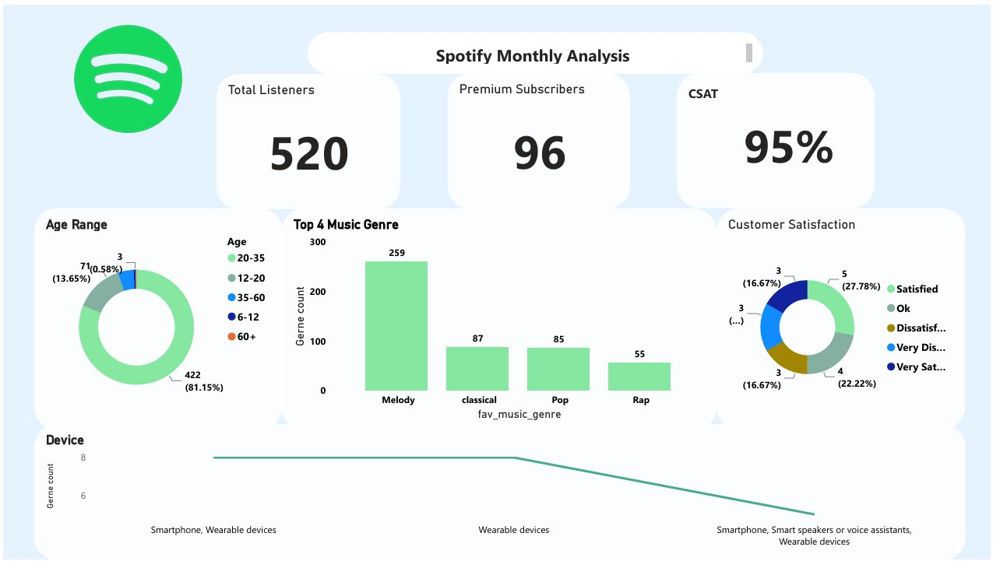

# Spotify Music Recommendation & Analysis System  

## Project Overview  
This project leverages **machine learning** and **data visualization** to analyze music listening behavior and recommend personalized songs.  

Using Spotify-inspired data, I built a **Random Forest Classifier** to predict music genres based on user demographics, mood, and listening preferences. The results are displayed in a **Power BI dashboard** for real-time insights, along with a **chatbot-style recommendation system**.  

---

## Key Features  
- **Spotify Monthly Analysis Dashboard (Power BI)**  
  - Total Listeners: **520**  
  - Premium Subscribers: **96**  
  - Customer Satisfaction (CSAT): **95%**  
  - Age Range & Device Usage distribution  
  - Top Music Genres with listener counts  

- **Machine Learning Model**  
  - Algorithm: **Random Forest Classifier** (n_estimators=1000, random_state=42)  
  - Accuracy: **73%** on test dataset  
  - Model serialized using **pickle** for deployment  

- **Song Recommendation Engine**  
  - Input: Age Range, Listening Mood, Preferred Time  
  - Output: Predicted Genre + Personalized Song Suggestion  
  - Example:  
    - Age: 20–35  
    - Mood: Office  
    - Time: Afternoon  
    - ✅ Predicted Genre: *Group 0 (Melody)*  
    - 🎵 Recommended Song: *Shoki Remix by Lil Kesh (2014)*  

---

## Business Recommendations  
Based on insights from the Power BI dashboard:  
1. **Increase Premium Subscribers**  
   - With only **96 premium users out of 520 total listeners**, Spotify should implement targeted campaigns (discounts, bundles, student plans) to convert free users into paying subscribers.  

2. **Maintain High CSAT (95%)**  
   - Focus on keeping satisfaction levels high by enhancing **personalized playlists** and **AI-driven song recommendations**.  
   - Regularly monitor **feedback loops** to prevent drops in user experience.  

3. **Expand Genre Diversity**  
   - Melody dominates (**259 listeners**) while Rap, Classical, and Pop have lower counts. Spotify could introduce **curated promotions** for underrepresented genres to broaden user engagement.  

4. **Target Age 20–35 Users**  
   - Since **81% of users are between 20–35**, strategies should focus on this demographic (e.g., campus promotions, lifestyle-based playlists).  

5. **Optimize Device Experience**  
   - With smartphones and wearables being the top devices, optimizing mobile UI and **seamless wearable integrations** will strengthen user retention.  

---

## Tech Stack  
- **Programming:** Python (Pandas, NumPy, Scikit-learn)  
- **Visualization:** Power BI, Matplotlib, Seaborn  
- **Modeling:** Random Forest Classifier  
- **Deployment:** Streamlit App, Pickle Model Storage  

---

## Project Snapshots  

### Dashboard (Power BI)  
  

### AC Score (Model Accuracy)  

### Bot (Song Recommendation Chatbot)  

---

## How It Works  
1. User selects **Age, Mood, and Time of Day**.  
2. Model predicts **music genre group**.  
3. Chatbot recommends a **non-repetitive personalized song** from the trained dataset.  
4. Dashboard provides **monthly insights** on listeners and trends.  

---

## Future Improvements  
- Expand dataset with more genres & songs.  
- Incorporate **deep learning models** (CNN/RNN for audio features).  
- Add **Spotify API integration** for live data streaming.  
- Build a **mobile-ready version** of the app.  
